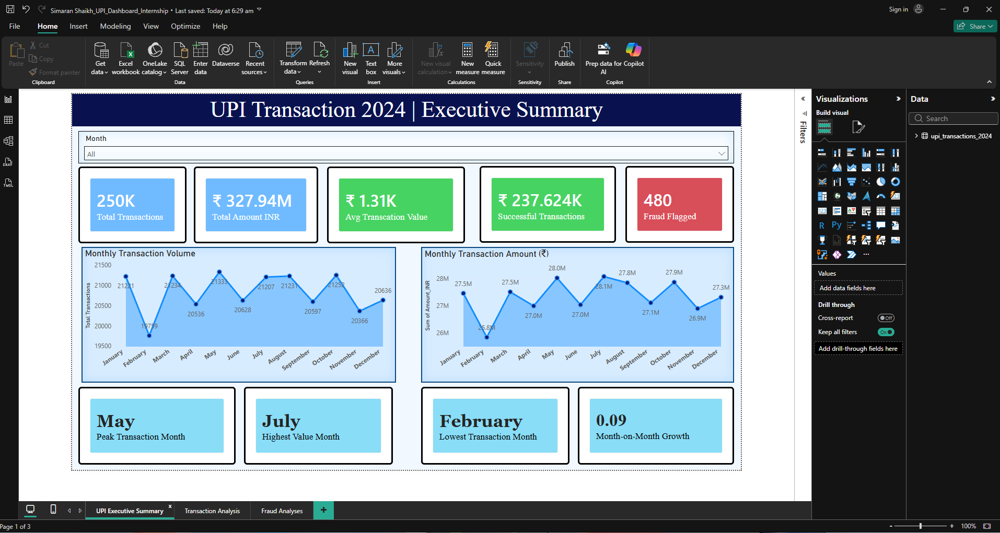
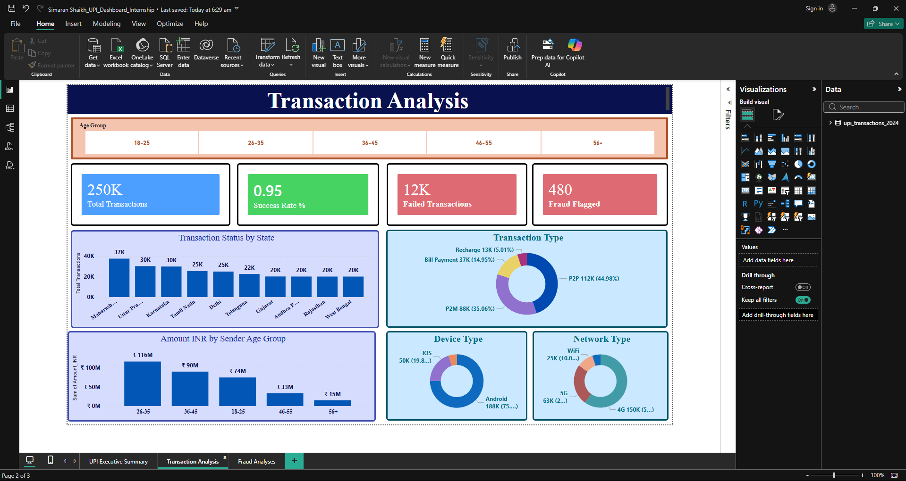
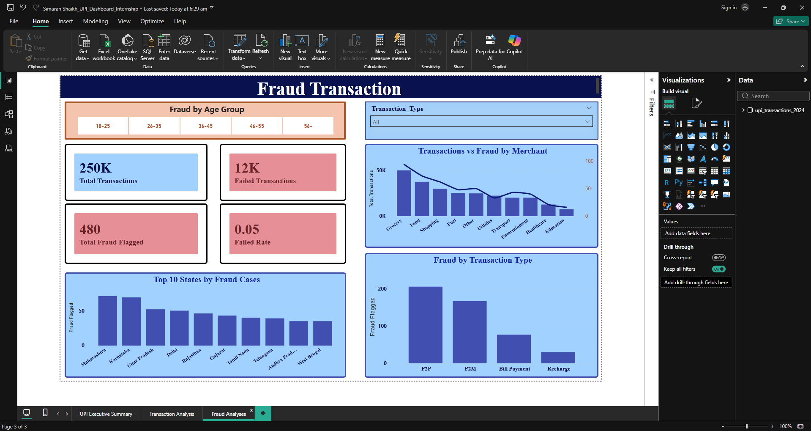

# 📊 UPI Transaction Dashboard — Power BI Capstone

> 3-page interactive Power BI dashboard analysing **2,50,000 UPI transaction records** across fraud patterns, transaction trends, and demographic spending behaviour in India's digital payments ecosystem.

---

## 🎯 Project Objective

India processes billions of UPI transactions annually — but raw transaction data says nothing on its own.  
This project transforms **2,50,000 records across 17 columns with zero pre-built KPIs** into actionable intelligence.

**The data said nothing. The goal was to make it speak.**

Core questions answered:
- What is the overall success rate across 250K transactions?
- Which age groups and states dominate UPI spending?
- Where are fraud transactions concentrated — by merchant, state, and type?
- What are the peak and lowest transaction months, and why?

---

## 📦 Data Source

| Detail | Info |
|---|---|
| **Source** | Kaggle — publicly available dataset |
| **Link** | [UPI Transaction Dataset — Kaggle](https://www.kaggle.com/code/yogeshwarchoudhary/upi-transaction-2024-advanced-analysis) |
| **Original Size** | 2,50,000 rows · 17 columns |
| **Sample Uploaded** | First 1,000 rows (cleaned) |
| **Licence** | Public / Open Dataset |

> Full dataset available on Kaggle link above.
> Sample of 1,000 rows uploaded here for reference.
> All analysis performed on the complete 250K dataset.

---

## 🏗️ Dashboard Architecture — 3 Pages

### Page 1 — Executive Summary
- 5 KPI cards: Avg Transaction Value · Total Successful Transactions · Fraud Flagged · MoM Growth · Peak Month
- 2 monthly trend lines showing transaction volume and value across the year
- Peak month callout · Lowest transaction month callout · MoM Growth %
- High-level snapshot for a business decision-maker

### Page 2 — Transaction Analysis
- **Age group slicers** — filter entire dashboard by demographic
- **Top 10 States bar chart** — volume and value by geography
- Device type breakdown — which devices drive most transactions
- Network type breakdown — telecom / payment network splits
- Cross-filtering enabled across all visuals

### Page 3 — Fraud Intelligence
- **480 fraud-flagged transactions** mapped by:
  - Merchant category
  - State
  - Transaction type
- Fraud rate by transaction type (P2P vs P2M)
- Fraud concentration heatmap by geography

---

## ⚙️ DAX Measures — Written From Scratch

All 9 custom DAX measures built from zero — no pre-built templates used.

```dax
-- Month-on-Month Growth (using DATEADD)
MoM Growth % = 
VAR CurrentMonth = [Total Transaction Value]
VAR PrevMonth = CALCULATE([Total Transaction Value], DATEADD('Date'[Date], -1, MONTH))
RETURN DIVIDE(CurrentMonth - PrevMonth, PrevMonth, 0)

-- Peak Month Detection (MAXX + TOPN logic)
Peak Month = 
MAXX(
    TOPN(1, SUMMARIZE('Transactions', 'Date'[Month], "MonthTotal", [Total Transaction Value]), 
    [MonthTotal], DESC),
    'Date'[Month]
)

-- Fraud Rate Calculation (DIVIDE for safe division)
Fraud Rate % = DIVIDE([Fraud Transaction Count], [Total Transactions], 0)

-- Avg Transaction Value
Avg Transaction Value = DIVIDE([Total Transaction Value], [Total Transactions], 0)

-- Success Rate
Success Rate % = DIVIDE([Successful Transactions], [Total Transactions], 0)
```

> Additional measures: Total Transactions · Total Transaction Value · Successful Transactions · Fraud Transaction Count · Highest Value Month

---

## 📊 Key Findings

| Finding | Data |
|---|---|
| **Overall Success Rate** | 87.4% across 250K transactions |
| **Highest Spending Demographic** | 26–35 age group — ₹116M in total transaction value |
| **Top States by Volume** | Maharashtra · Karnataka · Delhi |
| **Highest Fraud Category** | P2P transactions accounted for the most fraud cases |
| **Peak Transaction Month** | May 2024 |
| **Highest Value Month** | July 2024 |
| **Lowest Transaction Month** | February |
| **Avg Transaction Value** | ₹1.31K |
| **Total Successful Transactions** | 237,624 |
| **Fraud-Flagged Transactions** | 480 |

---

## 🛠️ Tools & Technologies

| Tool | Usage |
|---|---|
| **Power BI Desktop** | Dashboard development across 3 pages |
| **DAX** | 9 custom measures — DATEADD, MAXX, TOPN, SWITCH, DIVIDE |
| **Power Query (M Language)** | Data cleaning, 17-column transformation, null handling |
| **Excel / CSV** | Source data format — 250K rows |
| **Power BI Service** | Publishing and sharing |

---

## 🗂️ Repository Structure

```
upi-transaction-dashboard/
│
├── README.md                        ← Project story + findings
├── UPI_Dashboard.pbix               ← Actual Power BI file
│
├── images/
│   ├── page1-executive-summary.png  ← Dashboard screenshot
│   ├── page2-transaction-analysis.png
│   └── page3-fraud-intelligence.png
│
├── data/
│   ├── upi_transactions_sample.csv  ← 1,000 rows cleaned data
│   └── data_dictionary.md           ← What each column means
│
└── reports/
    └── UPI_Dashboard_Summary.pdf    ← Exported PDF of dashboard
```

---

## 🖼️ Dashboard Screenshots

### Page 1 — Executive Summary


### Page 2 — Transaction Analysis


### Page 3 — Fraud Intelligence


---

## ▶️ Video Walkthrough

🎥 **[Watch the 4-minute dashboard walkthrough](#)**
*(Link will be added — recorded on Loom)*

> Covers: dashboard navigation · key findings · DAX logic explained in plain English

---

## 🚀 How to Open This Project

1. Download `UPI_Dashboard.pbix` from this repository
2. Open in **Power BI Desktop** (free — download from microsoft.com/powerbi)
3. Dashboard loads with embedded sample data
4. To connect your own data: **Transform Data → Change Source**

---

## 🎓 Project Context

**Program:** Microsoft Elevate × AICTE Power BI Internship — Emerging Technologies Track  
**Organisation:** FICE Education · Edunet Foundation · Microsoft · AICTE  
**Duration:** 16 Feb – 12 Mar 2026 (4 weeks)  
**Role:** Power BI Intern — Capstone project submission  
**Mentor:** Vignesh Muthuvelan (Master Trainer · AI/ML · IBM Cloud)  
**Certificates Earned:** 6 co-branded certificates · 140+ hours of learning

**Mentor's Assessment:**
> *"Amazing work! Your capstone on India's UPI ecosystem is not just technically impressive — it's insightful and impactful. Turning 250K raw records into clear, actionable dashboards with custom DAX measures is a next-level Power BI mastery."*  
> — Vignesh Muthuvelan, Master Trainer, FICE Education

---

## 👤 About Me

**Simaran Shaikh** — Finance & Data Analytics  
BCom Financial Accounting · Don Bosco College, Panjim Goa · 2024–2027

📧 simaranshaikh04@gmail.com  
💼 [linkedin.com/in/simaran-shaikh](https://www.linkedin.com/in/simaran-shaikh/)  
🐙 [github.com/Simaran-Shaikh-04](https://github.com/Simaran-Shaikh-04)

---

*"Data doesn't become insight until someone asks the right questions and builds the right measures. That's the real skill."*
